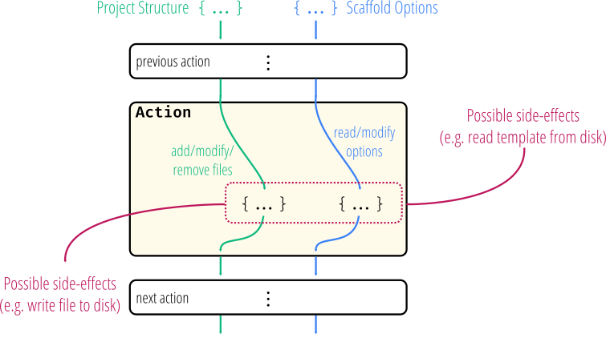

Action Pipeline
===============

PyScaffold organizes the generation of a project into a series of steps with
well defined purposes. As shown in the figure bellow,
each step is called **action** and is implemented as a
simple function that receives two arguments: a project structure and a :obj:`dict`
with options (some of them parsed from command line arguments, other from
default values).

An action **MUST** return a tuple also composed by a project structure and a
:obj:`dict` with options. The return values, thus, are usually modified versions
of the input arguments. Additionally an action can also have side effects, like
creating directories or adding files to version control. The following
pseudo-code illustrates a basic action:

.. code-block:: python

    def action(project_structure, options):
        new_struct, new_opts = modify(project_structure, options)
        some_side_effect()
        return new_struct, new_opts

The output of each action is used as the input of the subsequent action,
forming a pipeline. Initially the structure argument is just an empty :obj:`dict`.
Each action is uniquely identified by a string in the format
``<module name>:<function name>``, similarly to the convention used for a
`setuptools entry point`_.
For example, if an action is defined in the ``action`` function of the
``extras.py`` file that is part of the ``pyscaffoldext.contrib`` project,
the **action identifier** is ``pyscaffoldext.contrib.extras:action``.

By default, the sequence of actions taken by PyScaffold is:

#. :obj:`pyscaffold.actions:get_default_options <pyscaffold.actions.get_default_options>`
#. :obj:`pyscaffold.actions:verify_options_consistency <pyscaffold.actions.verify_options_consistency>`
#. :obj:`pyscaffold.structure:define_structure <pyscaffold.structure.define_structure>`
#. :obj:`pyscaffold.actions:verify_project_dir <pyscaffold.actions.verify_project_dir>`
#. :obj:`pyscaffold.update:version_migration <pyscaffold.update.version_migration>`
#. :obj:`pyscaffold.structure:create_structure <pyscaffold.structure.create_structure>`
#. :obj:`pyscaffold.actions:init_git <pyscaffold.actions.init_git>`
#. :obj:`pyscaffold.actions:report_done <pyscaffold.actions.report_done>`

(as given by :obj:`pyscaffold.actions.DEFAULT`)

The project structure is usually empty until :obj:`~pyscaffold.structure.define_structure`
This action just loads the in-memory :obj:`dict` representation, that is only written
to disk by the :obj:`~pyscaffold.structure.create_structure` action.

Note that, this sequence varies according to the command line options.
To retrieve an updated list, please use ``putup --list-actions`` or
``putup --dry-run``.

.. _setuptools entry point: https://setuptools.pypa.io/en/stable/userguide/entry_point.html
