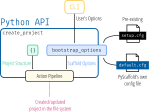

===============
Developer Guide
===============

This document describes the internal architecture and the main concepts behind
PyScaffold. It assumes the reader has some experience in *using* PyScaffold
(specially its command line interface, ``putup``) and some familiarity with `Python's
package ecosystem`_.

Please notice this document does not target PyScaffold's users, instead it
provides **internal** documentation for those who are involved in PyScaffold's
development.

.. _core-concepts:

Architecture
============

As indicated in the figure bellow, PyScaffold can be divided in two main
execution blocks: a pure Python API and the command line interface wrapping
it as an executable program that runs on the shell.

The CLI is responsible for defining all arguments ``putup``
accepts and parsing the user input accordingly. The result is a :obj:`dict`
that contains options expressing the user preference and can be fed
into PyScaffold's main API, :obj:`~pyscaffold.api.create_project`.

This function is responsible for combining the provided options :obj:`dict`
with pre-existing project configurations that might be available in the project
directory (the ``setup.cfg`` file, if present) and globally defined default
values (via :ref:`PyScaffold's own configuration file <configuration>`).
It will then create an (initially empty) *in-memory* representation of the
project structure and run PyScaffold's action pipeline, which in turn will
(between other tasks) write customized versions of PyScaffold's templates to
the disk as project files, according to the combined scaffold options.

The project representation and the action pipeline are two key concepts in
PyScaffold's architecture and are described in detail in the following
sections.

.. _project-structure:
.. include:: project-structure.rst

.. _action-pipeline:
.. include:: action-pipeline.rst

Extensions
==========

Extensions are a mechanism provided by PyScaffold to modify its action pipeline
at runtime and the preferred way of adding new functionality.
There are **built-in extensions** (e.g. :mod:`pyscaffold.extensions.cirrus`)
and **external extensions** (e.g. `pyscaffoldext-dsproject`_), but both types
of extensions work exactly in the same way.
This division is purely based on the fact that some of PyScaffold features are
implemented as extensions that ship by default with the ``pyscaffold`` package,
while other require the user to install additional Python packages.

Extensions are required to add at least one CLI argument that allow the users
to opt-in for their behaviour. When ``putup`` runs, PyScaffold's will
dynamically discover installed extensions via `setuptools entry points`_ and
add their defined arguments to the main CLI parser. Once activated, a
extension can use the helper functions defined in :mod:`pyscaffold.actions` to
manipulate PyScaffold's action pipeline and therefore the project structure.

For more details on extensions, please consult our :ref:`Extending PyScaffold
<extensions>` guide.

Code base Organization
======================

PyScaffold is organized in a series of internal Python modules, the main ones
being:

- :mod:`~pyscaffold.api`: top level functions for accessing PyScaffold
  functionality, by combining together the other modules
- :mod:`~pyscaffold.cli`: wrapper around the API to create a command
  line executable program
- :mod:`~pyscaffold.actions`: default action pipeline and helper functions for
  manipulating it
- :mod:`~pyscaffold.structure`: functions specialized in defining the in-memory
  project structure representation and in taking this representation and
  creating it as part of the file system.
- :mod:`~pyscaffold.update`: steps required for updating projects generated
  with old versions of PyScaffold
- :mod:`~pyscaffold.extensions`: main extension mechanism and subpackages
  corresponding to the built-in extensions

Additionally, a series of internal auxiliary libraries is defined in:

- :mod:`~pyscaffold.dependencies`: processing and manipulating of package
  dependencies and requirements
- :mod:`~pyscaffold.exceptions`: custom PyScaffold exceptions and exception handlers
- :mod:`~pyscaffold.file_system`: wrappers around file system functions that
  make them easy to be used from PyScaffold.
- :mod:`~pyscaffold.identification`: creating and processing of
  project/package/function names and other general identifiers
- :mod:`~pyscaffold.info`: general information about the system, user and
  package being generated
- :mod:`~pyscaffold.log`: custom logging infrastructure for PyScaffold,
  specialized in its verbose execution
- :mod:`~pyscaffold.operations`: file operations that can be
  embedded in the in-memory project structure representation
- :mod:`~pyscaffold.repo`: wrapper around the ``git`` command
- :mod:`~pyscaffold.shell`: helper functions for working with external programs
- :mod:`~pyscaffold.termui`: basic support for ANSI code formatting
- :mod:`~pyscaffold.toml`: thin adapter layer around third-party TOML parsing
  libraries, focused in API stability

For more details about each module and its functions and classes, please
consult our :doc:`module reference <api/modules>`.

When contributing to PyScaffold, please try to maintain this overall
project organization by respecting each module's own purpose.
Moreover, when introducing new files or renaming existing ones, please
try to use meaningful naming and avoid terms that are too generic, e.g.
``utils.py`` (when in doubt, Peter Hilton has a great `article about naming
smells`_ and a nice `presentation aboug how to name things`_).

.. _Python's package ecosystem: https://packaging.python.org
.. _pyscaffoldext-dsproject: https://pyscaffold.org/projects/dsproject/en/stable/
.. _setuptools entry points: https://setuptools.pypa.io/en/stable/userguide/entry_point.html
.. _article about naming smells: https://hilton.org.uk/blog/naming-smells
.. _presentation aboug how to name things: https://hilton.org.uk/presentations/naming
