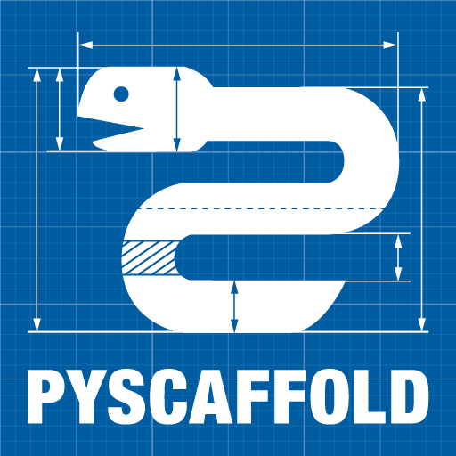

|

PyScaffold helps you to easily setup a new Python project, it is as easy as::

    putup my_project

This will create a new folder ``my_project`` containing a perfect *project
template* with everything you need for some serious coding.

Type ``putup -h`` to learn about more configuration options. PyScaffold assumes
that you have `Git  <http://git-scm.com/>`_ installed and set up on your PC,
meaning at least your name and email configured.
The project template in ``my_project`` provides you with a lot of
:ref:`features <features>`. PyScaffold is compatible with Python 2.7, 3.4 and
3.5.

Contents
--------

.. toctree::
   :maxdepth: 2

   Features <features>
   Installation <install>
   Examples <examples>
   Configuration <configuration>
   Contributions & Help <contrib>
   License <license>
   Authors <authors>
   Changelog <changes>
   Module Reference <api/modules>

Indices and tables
------------------

* :ref:`genindex`
* :ref:`modindex`
* :ref:`search`
